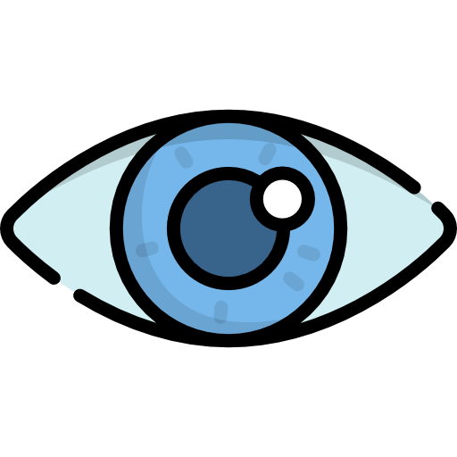
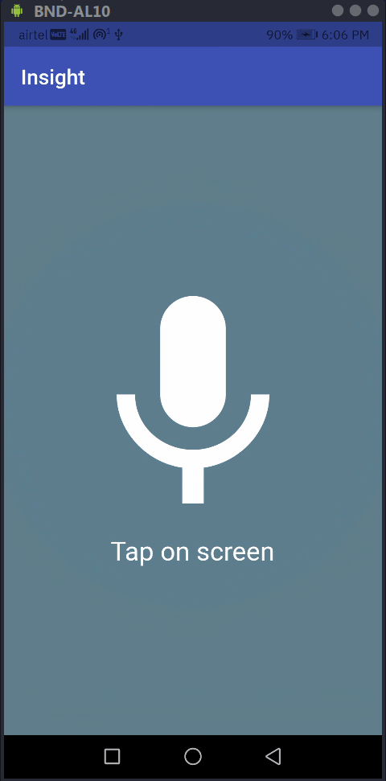
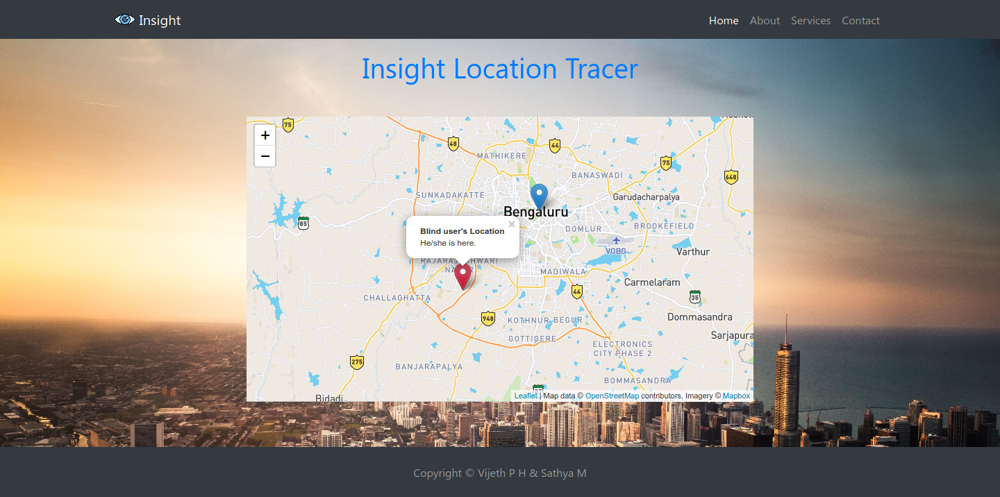
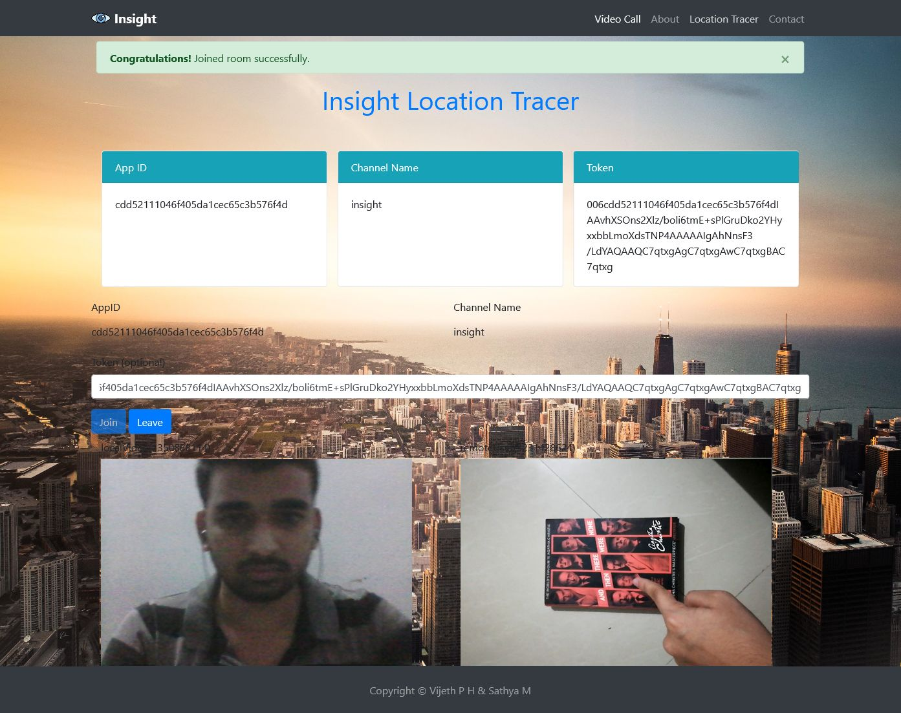
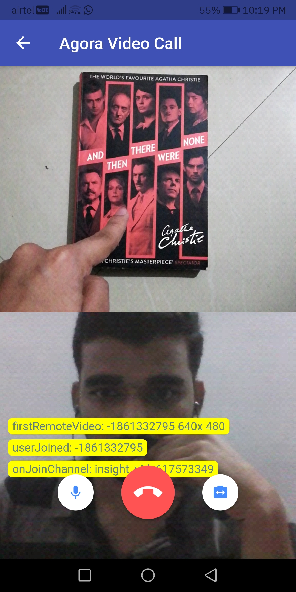

[](https://github.com/vijethph/Insight)
[](https://flutter.dev)
[](https://forthebadge.com)

<br />
<div align="center">
  <a href="https://github.com/vijethph/Insight">
    
  </a>

  <h2 align="center">Insight</h2>

  <p align="center">
    A Flutter app for blind people.
    <br />
    <br />
    <a href="https://github.com/vijethph/Insight/issues">Report Bug</a>
    ·
    <a href="https://github.com/vijethph/Insight/issues">Request Feature</a>
  </p>
</div>

<!-- TABLE OF CONTENTS -->

## Table of Contents

- [Table of Contents](#table-of-contents)
- [About The Project](#about-the-project)
  - [Built With](#built-with)
- [Getting Started](#getting-started)
  - [Prerequisites](#prerequisites)
  - [Installation](#installation)
- [Usage](#usage)
- [Contributing ](#contributing-)
- [License](#license)
- [Contact](#contact)
- [Thank You!](#thank-you)
- [Acknowledgements](#acknowledgements)

<!-- ABOUT THE PROJECT -->

## About The Project

|                            Face Recognition                             |                            Object Detection                             |                      OCR with speech output                      |                            Text Summarization                            |                               Google Translate API                               |
| :---------------------------------------------------------------------: | :---------------------------------------------------------------------: | :--------------------------------------------------------------: | :----------------------------------------------------------------------: | :------------------------------------------------------------------------------: |
|  |  |  |  |  |

|                                 GPS Location Tracing                                  |                                Video Call Backend Server                                |                             Video Call App Client                             |
| :-----------------------------------------------------------------------------------: | :-------------------------------------------------------------------------------------: | :---------------------------------------------------------------------------: |
|  |  |  |

> Please wait for sometime for the above GIFs to load. Otherwise, click on them to view them individually.

This is a Flutter app that uses [Firebase ML vision](https://firebase.google.com/docs/ml), [Tensorflow Lite](https://www.tensorflow.org/lite), and in-built speech recognition and text-to-speech capabilities to act like a third eye for blind people. It uses Firebase ML vision to detect human faces, and Tensorflow Lite model implementations of [MobileFaceNets](https://arxiv.org/abs/1804.07573) and [SSD MobileNetV2](https://arxiv.org/abs/1801.04381) to perform face recognition and object detection respectively. The blind user can authenticate with fingerprint, issue voice commands to perform face recognition, object detection, OCR, automatic URL and text summarization, translate languages, send GPS location, and perform video calling with volunteer. The app responds appropriately via voice output for every command issued. The text summarization API is built with Flask, Sumy, Trafilatura and is deployed to Heroku. It uses Latent Semantic Analysis(LSA) algorithm for text summarization. The blind user can use this app to detect and save human faces, detect objects in front of him/her, get voice output of text within objects, summarized result of text and URLs, translate sentences to different languages, video call, and also send his/her GPS location for tracing purposes.

### Built With

This project is entirely built with the following components and languages:

- [Flutter](https://flutter.dev/)
- [Firebase ML vision](https://firebase.google.com/docs/ml)
- [Google Translate API](https://cloud.google.com/translate)
- [Tensorflow Lite](https://www.tensorflow.org/lite)
- [MobileFaceNets](https://arxiv.org/abs/1804.07573)
- [SSD MobileNetV2](https://arxiv.org/abs/1801.04381)

<!-- GETTING STARTED -->

## Getting Started

You can download the pre-built apk file found in the `Releases` section. Follow these instructions in order to get a copy of the project up and running on your local machine for development and testing purposes.

### Prerequisites

Java Runtime Environment(JRE)>=8, Android SDK API level 28 or higher should be installed. Flutter and Dart SDKs should be installed. After installation, check Java version, and Flutter configuration using

```sh
java --version
flutter doctor
```

### Installation

1. Download or Clone the repo

```git
git clone https://github.com/vijethph/Insight.git
```

2. Open the downloaded project folder

```sh
cd Insight
```

3. Make sure Flutter executable is added to environment variables. Go to project root and execute the following command in console to get the required dependencies

```sh
flutter pub get
```

4. Connect your Android device to your desktop. Make sure it is properly connected by using

```sh
flutter devices
```

5. Install and run the app using

```sh
flutter run
```

<!-- USAGE EXAMPLES -->

## Usage

Once the app starts, authenticate yourself with fingerprint. Then, tap to issue voice commands like `recognize face`, `detect objects`, `read text` and `send my location` to perform respective functionalities. In face recognition screen, double tap to change camera, and once human face is detected, long tap to save detected face. The name for detected face can be given with voice input by tapping onto screen.

<!-- CONTRIBUTING -->

## Contributing [](https://github.com/vijethph/Insight/pulls)

Contributions are what make the open source community such an amazing place to be learn, inspire, and create. Any contributions you make are **greatly appreciated**.

1. Fork the Project
2. Create your Feature Branch (`git checkout -b feature/AmazingFeature`)
3. Commit your Changes (`git commit -m 'Add some AmazingFeature'`)
4. Push to the Branch (`git push origin feature/AmazingFeature`)
5. Open a Pull Request

<!-- LICENSE -->

## License

Distributed under the MIT License.

<!-- CONTACT -->

## Contact

Vijeth P H - [@vijethph](https://github.com/vijethph)

Sathya M - [@sathya5278](https://github.com/sathya5278)

Shashank Ashok Gadavi - [@Shashankgadavi](https://github.com/Shashankgadavi)

Sagar V - [@sagubantii1911](https://github.com/sagubantii1911)

Project Link: [https://github.com/vijethph/Insight](https://github.com/vijethph/Insight)

## Thank You!

[](https://forthebadge.com)

If you like this project, please ⭐ this repo and share it with others 👍

<!-- ACKNOWLEDGEMENTS -->

## Acknowledgements

- [Flutter Docs](https://flutter.dev/docs)
- [Firebase ML Docs](https://firebase.google.com/docs)
- [Tensorflow Lite Docs](https://www.tensorflow.org/lite/guide)
- [MobileFaceNets](https://arxiv.org/abs/1804.07573)
- [SSD MobileNetV2](https://arxiv.org/abs/1801.04381)
